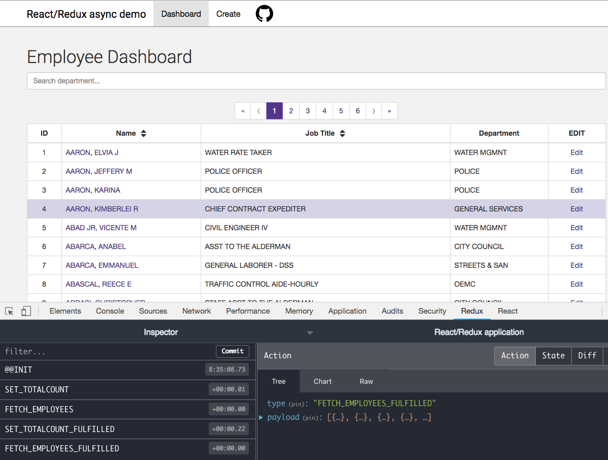
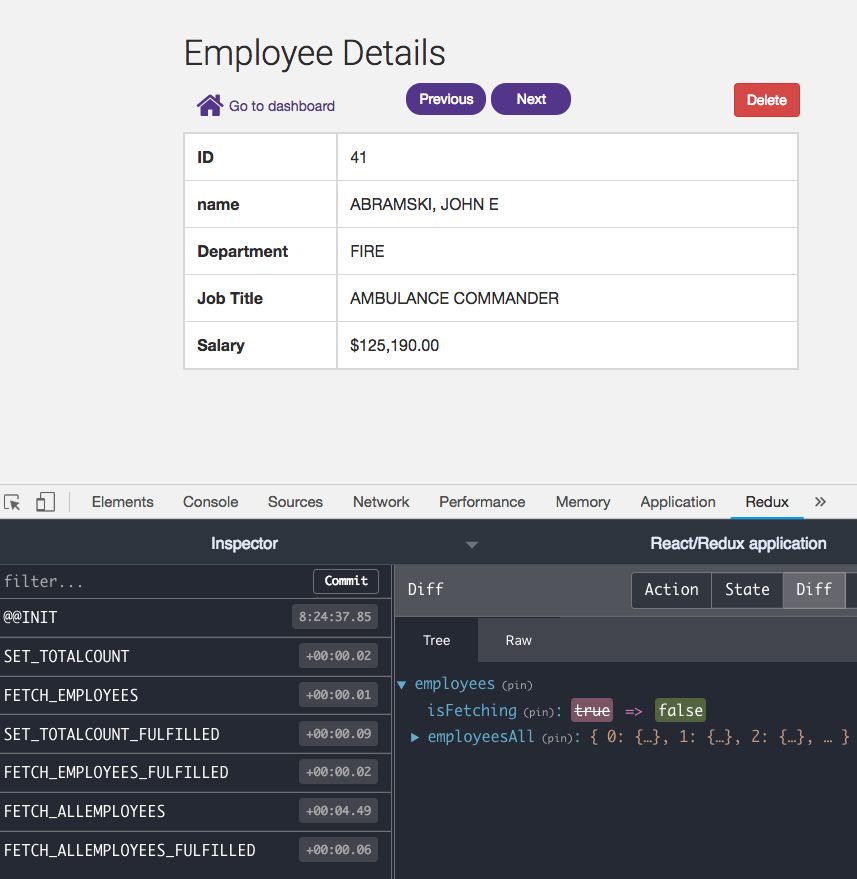
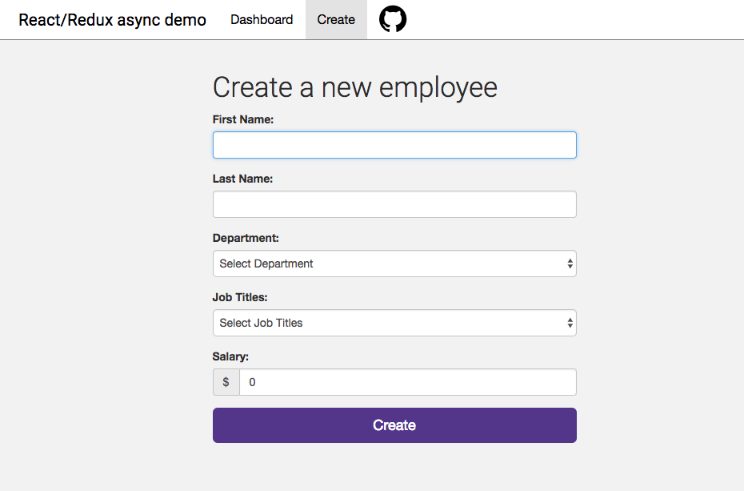

# React/Redux Async Actions Application

## Live Demo:
https://afternoon-thicket-91110.herokuapp.com/

## Front-End features
- React.js
- React router
- Redux
- Redux Middleware - **Redux Thunk**, Redux Logger
- Redux Async Actions
- Axios

**A five Redux async actions run in the application.**

## Back-End features
- Node/Express.js
- Mongoose/MongoDB
- RESTful APIs 

**List employees**
<table style="font-size:13px">
  <tr>
    <td style="background:#fafafa; font-weight: bold">HTTP Method</td>
    <td>GET</td>
  </tr>
  <tr>
    <td style="background:#fafafa; font-weight: bold">URL</td>
    <td>https://afternoon-thicket-91110.herokuapp.com/api/employees</td>
  </tr>
  <tr>
    <td style="background:#fafafa; font-weight: bold">Responses</td>
    <td>
      
200 OK

      
500 Server encountered an error
    
    </td>
  </tr>     
</table>

**Get a single employee**
<table style="font-size:13px">
  <tr>
    <td style="background:#fafafa; font-weight: bold">HTTP Method</td>
    <td>GET</td>
  </tr>
  <tr>
    <td style="background:#fafafa; font-weight: bold">URL</td>
    <td>https://afternoon-thicket-91110.herokuapp.com/api/employees/10</td>
  </tr>
  <tr>
    <td style="background:#fafafa; font-weight: bold">Responses</td>
    <td>
      
200 OK

      
404 Employee was not found
    
      
500 Server encountered an error
    
    </td>
  </tr>     
</table>

## Screenshot

